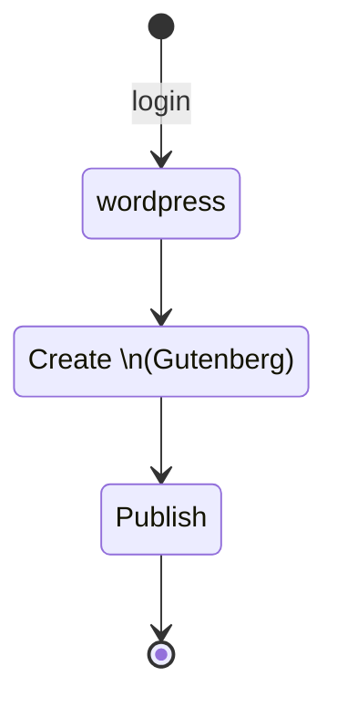
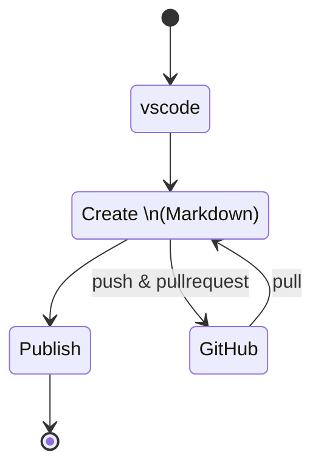
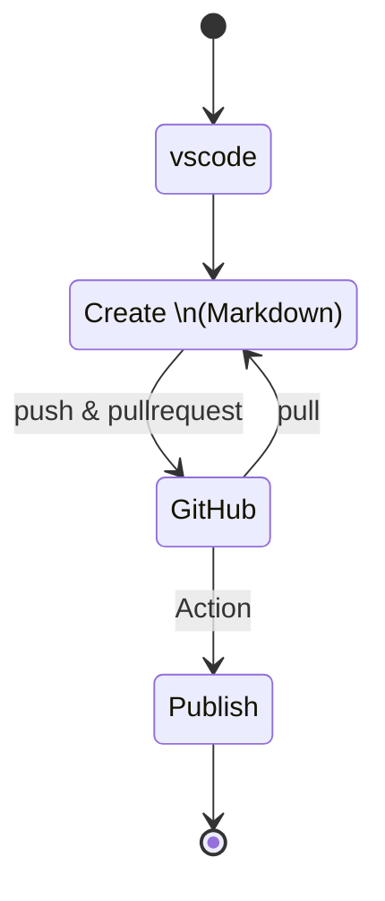

# WPPost-Action
This action detects Markdown files that have been changed in a commit and automatically submits them to Wordpress as articles based on their Markdown settings.

In a nutshell, it is a build-deploy-release tool for markdown wordpress articles done with githubAction.

You will be able to incorporate CICD into your wordpress article creation & updating as well as program source control.

## Why do I need CICD to submit articles to Wordpress?
CICD is a development process that automates the testing and release process to ensure high quality, safe, and fast delivery.
When applied to article production, CICD can be used to automatically proofread an article for publication, and if there are no problems, the article can be automatically published, greatly reducing quality concerns and the time and effort required for publication.

# Preface
* Article creation in Markdown
  Many people are using VSCode to create Wordpress markdown articles. I am one of them.

  VSCode has extensions that can be easily used for proofreading assistance and spell checking.
  With the help of various people, we have created [wp-post](https://github.com/hydro-cloud/wp-post), an extension that converts VSCode to html and allows you to post directly to Wordpress, and we have published it to [npm](https://www.npmjs.com/package/wp-post). This greatly reduces the burden of logging into Wordpress to create and post articles.

  The same source code is generated as that generated by the "Block Editor (Gutenberg)," so it has the same expressive power as previous articles.

* Introducing the github environment
  It did not take us long to start using gitHub for article creation as well.
  The management method of simply putting them in folders in a local environment became burdensome in many ways.
  
  we became dissatisfied with simple file management because we were not only creating new Markdown files, but also updating them.


  I no longer have to write at the same desk all the time, and when I do write an article, it is easy to write it down and merge it into one article.
  
Then I thought of it this way.

>Articles are created (developed) in text, updated (upgraded), checked in various ways (tested), turned into html in Wordpress (built), and published (released), just like the flow in programming.
Article checking can already be done automatically with textlint. Furthermore, if html generation and article submission (and image uploading) can be automated on gitHub, the *CICD* environment adopted in programming will be available!

Thereby.

* The benefits of this can be gained in article creation.
* No new learning costs since we have been using gitHub so far.
* Since the gitHub environment is used as it is, introduction and operation costs can be reduced.
* Approval and authority management becomes smarter.
  * Approval of an article = publication, eliminating the time and effort of publishing.
  * Article creators will no longer need to have their wordpress login information, wordpress application passwords, etc. in VScode.

Therefore, we created this action.


<table>
<tr>
<th style="text-align: center;">Initial </th>
<th style="text-align: center;">2nd</th>
<th style="text-align: center;">Now</th>
</tr>
<tr><td>



</td><td>



</td>
<td>



</td>
</tr>
</table>


# Usage

Just make this action **`hydro-cloud/WP-Post`** run in `.github/workflows/action.yml`.


```yml:.github/workflows/test.yml
name: CD

on:
  push
    paths:
      - '**.md'
jobs:

  build:
    name: Build
    runs-on: ubuntu-latest
    steps:
      - name: Checkout
        uses: actions/checkout@v2

      - name: Run WP-Post
        uses: hydro-cloud/WP-Post@1.0.0
        id: run
        with:
          token: ${{ secrets.GITHUB_TOKEN }}
          apiUrl: ${{vars.APIURL }}
          authUser:  ${{ vars.AUTHUSER }}  
          authPassword: ${{ secrets.AUTHPASSWORD }}

      - name: Result WP-Post
        run: |

          echo workspace:${{ steps.run.outputs.workspace }}
          echo ----------


          echo apiUrl:${{ steps.run.outputs.apiUrl }}
          echo authUser:${{ steps.run.outputs.authUser }}
          echo authPassword:${{ steps.run.outputs.authPassword }}
          echo exclude:${{ steps.run.outputs.exclude }}

          echo ----------

          echo changedFiles:${{ steps.run.outputs.changedFiles-number }}
          echo ${{ steps.run.outputs.changedFiles }}
          echo markdowns:${{ steps.run.outputs.markdowns-number }}
          echo ${{ steps.run.outputs.markdowns }}
          echo targets:${{ steps.run.outputs.targets-number }}
          echo ${{ steps.run.outputs.targets }}

          echo "---"

          echo posts:${{ steps.run.outputs.posts-number }}
          echo ${{ steps.run.outputs.posts }}

```
It is triggered at the timing of a push.
`hydro-cloud/WP-Post` extracts *.md*, but can also be triggered by specifying whether a particular file exists in the path.

Here it is executed in this step and the results are displayed.
* `- name: Run WP-Post`. 
 The action that generates html & posts the article (+ uploads images) is executed.
* `- name: Result WP-Post`. 
The result is displayed.

`- name: Run WP-Post` and pass the parameters for Wordpress posts *with* this action.


* Parameters (with)
  You can of course hard-code it, but generally you set that parameter in a gitHub configuration variable or secret.
  In this example, we do the following

  |  Parameters  |  Key  |   Actions secrets or variables  |
  | ---- | ---- |---- |
  |  apiUrl  |  APIURL  | Variables  |
  |  authUser  |  AUTHUSER  | Variables  |
  |  authPassword  |  AUTHPASSWORD  | Secrets  |

  > *secrets.GITHUB_TOKEN* is automatically populated and can be used without setting it.


 


## More Details

```
- name: Run WP-Post
  uses: hydro-cloud/WP-Post@1.0.0
  id: run
  with:
    token: ${{ secrets.GITHUB_TOKEN }}
    apiUrl: "<apiUrl>"
    authUser:  "<authUser>"  
    authPassword: "<authPassword>"
    exclude: "<exclude>"
```
Set four parameters as shown in the example above.

* token
Set GITHUB_TOKEN
* apiUrl
Address of WordpressRESTAPI
The address will be as follows
`https://<your-wodpress-url>wp-json/wp/v2`

* authUser
User name
This can be an email address or a user name.

* authPassword
Wordpress application password.
It is a string of 4 characters separated by the following
`xxxx xxxx xxxx xxxx xxxx xxxx`

* exclude(optional)
  Name of *Markdown file* to be excluded from processing. 
  The default value is `README.md`.


# About article creation and submission

**Front-matter** format
This is the familiar markdown format format used by gitHub.
You can write in normal markdown format with `---` headers and save as `.md`.
 
  ~~~
  ---
  title: title58
  status: draft
  ---
  # test1

  
  
  

  ~~~

  >If you specify `status: draft` as in this example, the post will be submitted in draft status.
  This is the recommended status for testing!
  See the *status* entry in [Posts](https://developer.wordpress.org/rest-api/reference/posts/) at https://developer.wordpress.org/ for more information.
  We use the aforementioned [wp-post](https://github.com/hydro-cloud/wp-post) internally, so we hope you will also refer to it.


* Folder and file structure
Since it detects modified .md files, markdown articles submitted to wordpress can be placed in any folder.
However, it is easier to operate if you make some rules, so here is an example of folder/file structure and implementation for actual use.
  
  In combination with the action installation described above, we recommend the following structure, which creates folders for each article in `posts`.

  ```
  ├── .git
  ├── .github
  │   └── workflows
  │         └── action.yml
  ├── posts
  │   ├── some-post1
  │   │    ├── images
  │   │    │   ├── screenshot092948.png
  │   │    │   ├── screenshot100148.png
  │   │    │   └── screenshot100152.png
  │   │    ├── some-post1.png
  │   │    └── some-post1.md
  │   ├── some-post1
  │   ...
  │
  └── README.md

  ```
  * `posts` and folders for posts
    Create a folder for each post (such as *some-post1* here **wordpress post slug** ) inside the `posts` folder.
    * .md
    .md file (ex: *some-post1.md* ) with the same name as the folder for posts.
    * images
    Create an *images* folder on the same level as *.md* and save the images in it.
      >[Paste Image](https://marketplace.visualstudio.com/items?itemName=mushan.vscode-paste-image) is used so that the image is saved in *images/* on the same level as the markdown file. (Animation gifs are also saved in this folder. (animation gifs are also placed in this folder)
    * eye-catching image
    (The animation gif should also be placed in this folder.) * Eye-catching image *some-post1.png* should be placed in the same folder as the markdown file, and should have the same name and extension.


# FAQ
1. Q. The generated html does not match my Wordpress.
    A. We are planning to add more parameters so that you can change them in subsequent versions. If you have a request, please add it to an issue.


# Links
* [wp-post](https://www.npmjs.com/package/wp-post)